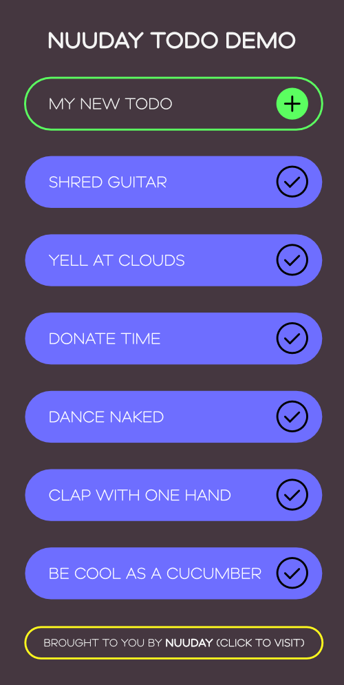

# Behavior Driven Components For Android by Nuuday
Make Your Android App Composable And Get Out Of Base-Class Hell.

## What is this library about? What's the problem?
**>All my fragments that inherits from my BaseFragment need to know if they're connected to the internet, wait, except one, but it needs all the other features..**

**>Oh well, I'll just inherit from BaseFragment and ignore that part for one component..**

**>Alright, now some of my fragments need a feature, but not the others... How in the world do I solve this in a nice way? More inheritance layers?**

If you've ever made a BaseFragment (or another BaseComponent) in your Android project, then a problem like the one above is probably something you've encountered. 

**So, what is the problem:**
- Using BaseComponents causes a multitude of problems as your project scales
- Component code in Android can quickly grow beyond comprehension as more features are added to the component
- A single Fragment or Activity can often begin to take care of multiple UI responsibilities, that are unconnected, but which all needs to be in the same component 
- An Application object can often grow to take care of a multitude of initialization, twisting the onCreate() function into an unholy mess

## So how does this library solve the issue?
This library makes Android components use the principle of composition over inheritance.

Decouple uncorrelated logic into declared **Behaviors**. Behaviors gets called in order of decleration, with the same lifecycle methods as the parent component.

For example, here's a fragment, close to the sample projects MainFragment:

```kotlin
class MainFragment : BehaviorDrivenFragment() {

    init {
        behaviours.addAll(
            CreateDatabindingViewFragmentBehavior(..),
            InitiateWelcomeTextFragmentBehavior(..),
            CollapseTextOnInitalTodosFragmentBehavior(..)
        )
    }
    
}
```

Every behavior has a single UI responsibility, and each of the behaviors make sense if you interact with the sample application. 

A Behavior is just a simple Kotlin interface, with methods you can choose to override if you need them:

```kotlin
interface FragmentBehaviour {

    fun onCreate(savedState: Bundle?){
        // Override for onCreate behavior
    }

    fun onResume(){
        // Override for onResume behavior
    }

    fun onPause(){
        // Override for onPause behavior
    }
    
    fun onDestroy(){
        // Override for onDestroy behavior
    }

    fun onCreateViewBehavior(
        inflater: LayoutInflater,
        container: ViewGroup?,
        savedInstanceState: Bundle?
    ): View? {
        return null // Override and return a view to propegate it to parent fragment
    }

    ..
}
```

In case the parent needs a return value, the first behavior to provide it, gets returned by the parent.

**It is recommended to move all component code into behaviors when refactoring with this library, to avoid lifecycle conflicts**

## Sample project
A small ToDo app is used to illustrate the mechanism of Behavior Driven Components.



The sample uses both a composable application, activity and fragment to illustrate the use of behaviors.

## I have a component that needs to become behavior driven, but is not in the library?
If you implement the IBehaviorDrivenComponent interface (IBehaviorDrivenFragment for example), you can hook any native component into a behavior driven architecture.

This way you can start reusing behaviors beyond just Fragments, DialogFragments and well into other Native toplevel components.

License
-------

    Copyright 2020 Nuuday

    The library is licensed under the Apache License, Version 2.0 (the "License");
    you may not use this file except in compliance with the License.
    You may obtain a copy of the License at

       http://www.apache.org/licenses/LICENSE-2.0

    Unless required by applicable law or agreed to in writing, software
    distributed under the License is distributed on an "AS IS" BASIS,
    WITHOUT WARRANTIES OR CONDITIONS OF ANY KIND, either express or implied.
    See the License for the specific language governing permissions and
    limitations under the License.


